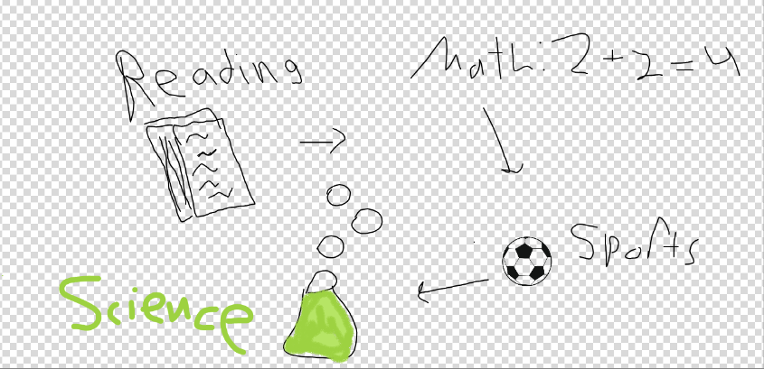

## Zafeer's home page
CSSE Blog: August 2023 to February 2024

My name is Zafeer Ahmed, I'm a sophomore at Del Norte. In my free time I play soccer, and I enjoy reading. When I grow up I want to do something with coding and maybe biology. I speak 2 languages, and I also enjoy chess.

**Here is an image about me:**

    

### My Socials
- [Instagram](N/A)
- [Discord](Zafy1314)
- [My email](zafeer10ahmed@gmail.com)

## Overview of Hacks, Study and Tangibles
Blogging in GitHub pages is a way to learn and code at the same time. 

- Plans, Lists, [Scrum Boards](https://clickup.com/blog/scrum-board/) help you to track key events, show progress and record time.  Effort is a big part of your class grade.  Show plans and time spent!
- [Hacks(Todo)](https://levelup.gitconnected.com/six-ultimate-daily-hacks-for-every-programmer-60f5f10feae) enable you to stay in focus with key requirements of the class.  Each Hack will produce Tangibles.
- Tangibles or [Tangible Artifacts](https://en.wikipedia.org/wiki/Artifact_(software_development)) are things you accumulate as a learner and coder. 
